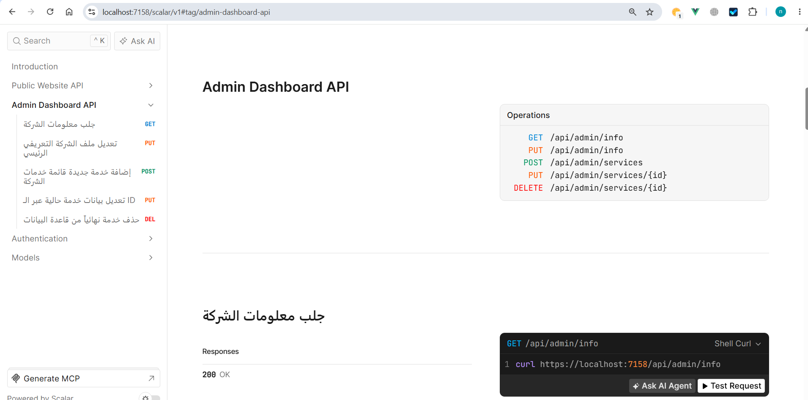

# 🏢 Company Profile API (.NET 10 & Minimal APIs)

A work-in-progress Web API project for building a Company Profile system using **.NET 10** and **Minimal APIs**.

The project is developed incrementally with a focus on clean architecture, security, maintainability, and practical backend development.

---

## 🚧 Project Status: Work in Progress

This project is still under active development. New features, improvements, security enhancements, and refactoring are continuously being added.

> **Note:** The current implementation is not the final version and may change as the project evolves.

---

## ✨ Current Features

* **.NET 10 Minimal APIs**
* **Native OpenAPI**
* **Scalar API Documentation**
* **Multi-Project Architecture:**
  * `Api`
  * `Core`
  * `Infrastructure`
* **DTO-based API design**
* **Entity Framework Core & SQLite Database**
* **Configurable CORS**
* **ASP.NET Core Identity**
* **Cookie-Based Session Authentication**
  * Secure Session Token Hashing
  * Session Management (View active sessions, Revoke single/all/other sessions)
  * Sliding Expiration & Absolute Expiration
  * User-Agent verification

---

## 📂 Solution Structure

```text
CompanyProfile
│
├── CompanyProfile.Api
│   ├── Endpoints
│   ├── Services
│   ├── Common
│   ├── Program.cs
│   └── appsettings.json
│
├── CompanyProfile.Core
│   ├── Entities
│   └── DTOs
│
└── CompanyProfile.Infrastructure
    ├── Data
    ├── Migrations
    └── company.db
    
```
    
    
    ## 🚀 Getting Started

### Prerequisites
* [.NET 10 SDK](https://dotnet.microsoft.com/)
* [Git](https://git-scm.com/)

### Clone & Run

```bash
# Clone the repository
git clone [https://github.com/NoofSaeed/CompanyProfile.git](https://github.com/NoofSaeed/CompanyProfile.git)

# Navigate to the API directory
cd CompanyProfile/CompanyProfile.Api

# Run the application
dotnet run

# Scalar API documentation:


add scalar.png
* https://localhost:<port>/scalar/v1

The port may differ depending on your local configuration.

---
## 📚 Technologies

* **C#**
* **.NET 10**
* **ASP.NET Core Minimal APIs**
* **Entity Framework Core**
* **SQLite**
* **ASP.NET Core Identity**
* **Scalar**

---

## ⭐ Feedback

This project is being built and improved step by step.

If you find it useful, feel free to **⭐ Star** the repository and share your feedback!